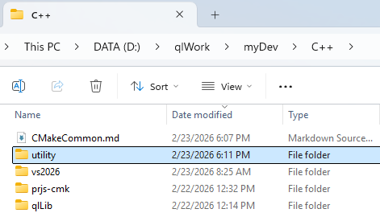
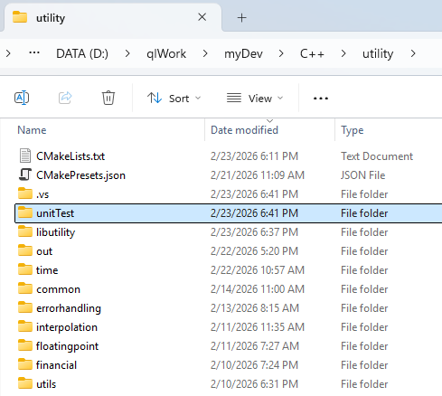
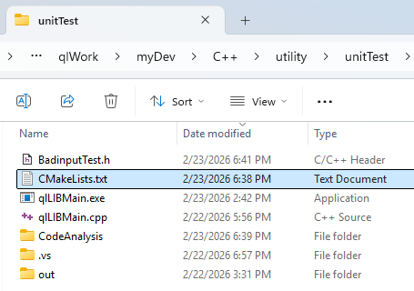
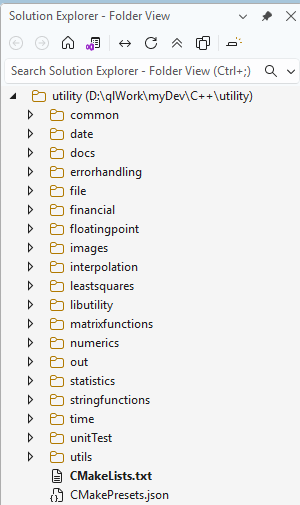
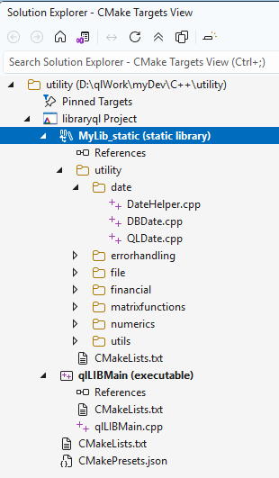

# CMake with Visual Studio 2026: Working Samples and Guide
    Compile static-lib and exe-App under one project

In Visual Studio 2026, **Property Sheet** (a .props file), which was an important and useful feature of earlier Visual Studios, is not needed for CMake Project, which does not depend on .sln or .vcxproj files and is cross platform.

CMake Project utilizes **CMakeLists.txt** and CMakePresets.json files for C++ compiling setings. You can download them here, edit and use for your own purpose.

### Dir structure
My C++ codes are under dir(C++):

I put common definitions in [CMakeCommon.md](#Notes).

My CMake Project **utility** under dir(C++) is:

You need both **CMakeLists.txt** and **CMakePresets.json**.

My test sub-project **unitTest** (and static-lib sub-project **libutility**) under dir(utility) is shown below:

You need the **CMakeLists.txt** under both unitTest and libutility.

### Compile static library & executable
1. Start VS2026 and choose "Open a folder." In my case, I choose **utility**, and see **Folder View** on the right:

2. Right-click anywhere in Folder View and choose "Switch to CMake Targets View" and the following shows up:

3. Right-click **MyLib_static (static library)** and choose "Build MyLib_static" to compile the LIB.

4. Right-click **qlLIBMain (executable)** and choose "Build qlLIBMain" to compile the EXE.

### Notes
This repository contains some of the sub-dirs of my **utility**.

Dir(C++) in this repository contains two help files:
- CMakeCommon.md
- get-cpp-fnames.ps1: used to obtain the .cpp list in **libutility/CMakeLists.txt**
